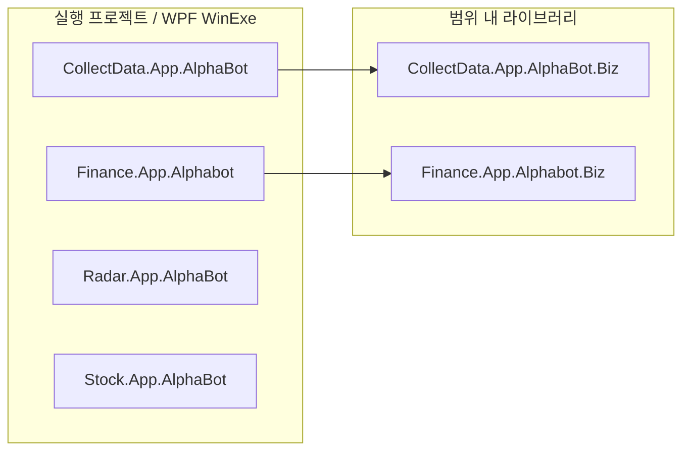

# 01. FinUp AlphaBot 프로젝트 인벤토리

> 분석 범위: `/mnt/c/Dev` 내 `FinUp.*AlphaBot*` 경로 중 `Test` 포함 프로젝트 제외.  
> 방법: `.sln`, `.csproj`, `App.xaml`, `MainWindow`, `AlphaBotBiz`, 정적 코드 검색. 빌드/실행/DB/API 호출 없음.

## 대상 프로젝트 요약

| 제품군 | 프로젝트 | 유형 | 프레임워크 | 역할 요약 | 주요 진입점/초기화 근거 |
|---|---|---:|---|---|---|
| CollectData | `FinUp.CollectData.App.AlphaBot` | 실행(WPF `WinExe`) | `net6.0-windows7.0` | 뉴스/시장지표/크롤러 계열 AlphaBot UI 및 스케줄 시작점 | `FinUp.CollectData.App.AlphaBot.csproj:5-6`, `App.xaml:5`, `MainWindow.xaml.cs:23-25`, `ViewModel/MainViewModel.cs:27-62` |
| CollectData | `FinUp.CollectData.App.AlphaBot.Biz` | 라이브러리 | `net6.0` | CollectData 실제 작업 매핑/스케줄 판정/실행 이력 기록 | `FinUp.CollectData.App.AlphaBot.Biz.csproj:4`, `AlphaBotBiz.cs:27-35`, `AlphaBotBiz.Connect.cs:12-48` |
| Finance | `FinUp.Finance.App.Alphabot` | 실행(WPF `WinExe`) | `net6.0-windows` | 금융 RSS/랭킹/일정 AlphaBot UI 및 스케줄 시작점 | `FinUp.Finance.App.Alphabot.csproj:4-5`, `App.xaml:5`, `ViewModel/MainViewModel.cs:26-62` |
| Finance | `FinUp.Finance.App.Alphabot.Biz` | 라이브러리 | `net6.0` | Finance 작업 매핑/DB DAO/파일 다운로드 처리 | `FinUp.Finance.App.Alphabot.Biz.csproj:4`, `AlphaBotBiz.cs:22-25`, `AlaphaBotBiz.Connect.cs:17-35` |
| Radar | `FinUp.Radar.App.AlphaBot` | 실행(WPF `WinExe`) | `.NET Framework v4.7` | 레이더/테마/뉴스/푸시/공시/텔레그램 작업 스케줄러 | `FinUp.Radar.App.AlphaBot.csproj:8-11`, `App.xaml:5`, `MainWindow.xaml.cs:86-145` |
| Stock | `FinUp.Stock.App.AlphaBot` | 실행(WPF `WinExe`) | `.NET Framework v4.7` | 주식/결제/푸시/API 큐/AWS/외부 업로드/텔레그램 작업 스케줄러 | `FinUp.Stock.App.AlphaBot.csproj:8-12`, `App.xaml:5`, `MainWindow.xaml.cs:60-107` |

## 솔루션/프로젝트 파일 발견 결과

| 경로 | 포함 프로젝트 | 비고 |
|---|---|---|
| `FinUp.CollectData.App.AlphaBot/FinUp.CollectData.App.AlphaBot.sln` | `FinUp.CollectData.App.AlphaBot`, `FinUp.CollectData.App.AlphaBot.Biz` | `.sln`의 `Project(...)` 항목에서 2개 확인 (`.sln:6`, `.sln:8`) |
| `FinUp.Finance.App.AlphaBot` | `.sln` 미발견, `.csproj` 2개 | 앱→Biz 참조로 관계 확인 |
| `FinUp.Radar.App.AlphaBot` | 단일 `.csproj` | 루트 실행 프로젝트 |
| `FinUp.Stock.App.AlphaBot` | 단일 `.csproj` | 루트 실행 프로젝트 |

## 실행 프로젝트와 라이브러리 프로젝트 분류

## 프로젝트별 주요 작업 매핑

| 제품군 | OIdx/Case | 매핑된 작업 | 근거 |
|---|---:|---|---|
| CollectData | 30010/30011/30012 | `ProcCrawlerSite` | `AlphaBotBiz.Connect.cs:17-25` |
| CollectData | 30020 | `ProcCrawlerIndex` | `AlphaBotBiz.Connect.cs:26-28` |
| CollectData | 30030 | `ProcNaverStockRank` | `AlphaBotBiz.Connect.cs:29-31` |
| CollectData | 30040 | `ProcCrawlerInfoStock` | `AlphaBotBiz.Connect.cs:32-34` |
| CollectData | 30050 | `ProcMongoClean` | `AlphaBotBiz.Connect.cs:35-37` |
| CollectData | 30060 | `ProcCrawlerSiteTheme` | `AlphaBotBiz.Connect.cs:38-40` |
| CollectData | 30070 | `ProcCrawlerSiteCheck` | `AlphaBotBiz.Connect.cs:41-43` |
| Finance | 40001 | `ProcRanking` | `AlaphaBotBiz.Connect.cs:22-24` |
| Finance | 40002 | `ProcInvestRss` | `AlaphaBotBiz.Connect.cs:25-27` |
| Finance | 40003 | `ProcStockSchedule` | `AlaphaBotBiz.Connect.cs:28-30` |
| Radar | 10010~10530 | 공시, 가격, 키워드, 푸시, 주문, 텔레그램, 테마로그 등 | `MainWindow.xaml.cs:556-685`, `Operation/Process.cs:51-286` |
| Stock | 1~175, 1000 | AppPush, 결제, StockRadar/Xing 실행, API 큐, AWS, 이메일, 외부 업로드 등 | `MainWindow.xaml.cs:425-663`, `Operation/ProcessUnit.cs` |

## 설정/비밀값 위치 요약

값은 출력하지 않았다. 키/위치만 기록한다.

| 프로젝트 | 설정 파일 | 민감 가능 키/이름 예시 | 위험도 |
|---|---|---|---:|
| CollectData | `App.Debug.config`, `App.Release.config`, `App.Staging.config` | `DBThemeRadar`, `MongoConnection*`, `ConnectionKafka`, `HtsTelegramBotToken`, `ChatId*`, `InfoStockID`, `InfoStockPassword` | 높음 |
| Finance | `App.config` | `DBStockData`, `FileUserID`, `FileUserPwd` | 높음 |
| Radar | `App.config` | `DBThemeRadar*`, `MongoConnection*`, `RedisConnection`, `TelegramBotKey`, API URL/Log Sender | 높음 |
| Stock | `App.config` | `DBStockPoint`, `ServerID`, `ServerPWD`, `RealExtComm`, `DBMessageService*`, `ChatApiKey`, `AWSAccessKey`, `AWSSecretKey`, `Naver*`, `bitlyToken`, `YoutubeDataAPIKey` | 매우 높음 |

