# 02. 프로젝트 간 참조 관계 및 의존성 맵

## 프로젝트 참조 그래프

```mermaid
flowchart TD
  CApp[FinUp.CollectData.App.AlphaBot\nWinExe net6.0-windows7.0]
  CBiz[FinUp.CollectData.App.AlphaBot.Biz\nlib net6.0]
  CoreDSApp[FinUp.Core.DS.App]
  CoreDSDac[FinUp.Core.DS.Dac]

  FApp[FinUp.Finance.App.Alphabot\nWinExe net6.0-windows]
  FBiz[FinUp.Finance.App.Alphabot.Biz\nlib net6.0]
  CoreNetData[FinUp.Core.NET.Data]
  CoreNet[FinUp.Core.NET]

  RApp[FinUp.Radar.App.AlphaBot\nWinExe net47]
  CoreDataMongo[FinUp.Core.Data.MongoDB]
  CoreData[FinUp.Core.Data]
  CoreLog[FinUp.Core.Log]
  CoreRedis[FinUp.Core.Redis]
  Core[FinUp.Core]
  Radar[FinUp.Radar]
  StockDataRedis[FinUp.StockData.Biz.Redis]
  StockDataFund[FinUp.StockData.Fundamentals]
  StockDataModel[FinUp.StockData.Model]

  SApp[FinUp.Stock.App.AlphaBot\nWinExe net47]
  CoreFund[FinUp.Core.Fundamentals]
  StockApp[FinUp.Stock.App]

  CApp --> CoreDSApp
  CApp --> CBiz
  CBiz --> CoreDSDac

  FApp --> FBiz
  FBiz --> CoreNetData
  FBiz --> CoreNet

  RApp --> CoreDataMongo
  RApp --> CoreData
  RApp --> CoreLog
  RApp --> CoreRedis
  RApp --> Core
  RApp --> Radar
  RApp --> StockDataRedis
  RApp --> StockDataFund
  RApp --> StockDataModel

  SApp --> CoreFund
  SApp --> StockApp
```

## 직접 프로젝트 참조

| 프로젝트 | 직접 참조 | 근거 |
|---|---|---|
| `FinUp.CollectData.App.AlphaBot` | `FinUp.Core.DS.App`, `FinUp.CollectData.App.AlphaBot.Biz` | `FinUp.CollectData.App.AlphaBot.csproj:12-13` |
| `FinUp.CollectData.App.AlphaBot.Biz` | `FinUp.Core.DS.Dac` | `FinUp.CollectData.App.AlphaBot.Biz.csproj:15` |
| `FinUp.Finance.App.Alphabot` | `FinUp.Finance.App.Alphabot.Biz` | `FinUp.Finance.App.Alphabot.csproj:10` |
| `FinUp.Finance.App.Alphabot.Biz` | `FinUp.Core.NET.Data`, `FinUp.Core.NET` | `FinUp.Finance.App.Alphabot.Biz.csproj:19-20` |
| `FinUp.Radar.App.AlphaBot` | `FinUp.Core.Data.MongoDB`, `FinUp.Core.Data`, `FinUp.Core.Log`, `FinUp.Core.Redis`, `FinUp.Core`, `FinUp.Radar`, `FinUp.StockData.*` | `FinUp.Radar.App.AlphaBot.csproj` `ProjectReference` 항목 |
| `FinUp.Stock.App.AlphaBot` | `FinUp.Core.Fundamentals`, `FinUp.Stock.App` | `FinUp.Stock.App.AlphaBot.csproj:283-287` |

## 외부 패키지/어셈블리 의존성 성격

| 제품군 | 주요 외부 의존성 | 사용 성격/위험 |
|---|---|---|
| CollectData | `CefSharp.OffScreen.NETCore`, `NLog`, `WebDriverManager`, Telegram/Kafka 관련 코드 | 웹 크롤링/브라우저 자동화, 파일 로그, 외부 메시징. 크롤러 차단·브라우저 버전·토큰 노출 리스크 |
| Finance | `HtmlAgilityPack`, `SimpleImpersonation`, `System.Configuration.ConfigurationManager`, Syndication | RSS/HTML 파싱, 파일 경로/계정 설정 사용. 파일 권한·외부 RSS 변화 리스크 |
| Radar | MongoDB, Redis, Google API, StackExchange.Redis, Interop.DANALCOMLib, NLog/Trace | DB/캐시/외부 결제/텔레그램/공시 API 혼합. 단일 UI 앱에 다양한 운영 의존성이 집중됨 |
| Stock | AWS SDK, FirebaseAdmin, Google/YouTube API, NLog, MQTT, MoonAPNS, DANAL COM | 운영 API·결제·푸시·AWS 모니터링·외부 업로드가 한 실행 파일에 집중. 설정 비밀값과 장애 전파 리스크 큼 |

## 공통 라이브러리 의존성 관찰

| 공통 계층 | 사용 프로젝트 | 역할 추정 | 근거 |
|---|---|---|---|
| `FinUp.Core.*` | Radar, Stock, Finance | DB 유틸, 확장 메서드, Redis/Mongo/로그 공통 | 각 `.csproj` `ProjectReference`, `using FinUp.Core.*` |
| `FinUp.Core.DS.*` | CollectData | DS 계열 설정/모델/DAC | `ViewModel/MainViewModel.cs:2-7`, `AlphaBotBiz.cs:1-6` |
| `FinUp.Stock.App` | Stock AlphaBot | SQL/Entity/Util 재사용 | `FinUp.Stock.App.AlphaBot.csproj:287`, `MainWindow.xaml.cs:9,12` |
| `FinUp.Radar` | Radar AlphaBot | Radar 모델/SQL/서버 타입 | `MainWindow.xaml.cs:27-29`, `.csproj ProjectReference` |

## 의존성 리스크

| 등급 | 항목 | 설명 | 근거 |
|---:|---|---|---|
| 높음 | 실행 프로젝트가 DB/외부 API/스케줄/화면을 동시에 담당 | WPF UI 스레드와 백그라운드 Thread/DispatcherTimer가 섞여 장애 격리가 약함 | `Radar MainWindow.xaml.cs:64-68`, `Stock MainWindow.xaml.cs:47-50` |
| 높음 | Stock AlphaBot의 외부 SDK 집중 | AWS, Firebase, Google, 결제/문자/외부 업로드까지 단일 프로세스 | `FinUp.Stock.App.AlphaBot.csproj` References, `Operation/ProcessBase.cs:72-95` |
| 중간 | 레거시 `packages.config`/어셈블리 참조 | Radar/Stock은 .NET Framework 4.7과 직접 assembly reference 혼합 | `packages.config`, `.csproj:60-190` 계열 |
| 중간 | Core/SQL 계층이 프로젝트 외부 | 실제 SQL 생성/실행 세부는 참조 프로젝트에 분산되어 영향 범위 추적 난이도 상승 | `ProjectReference` 그래프 |

