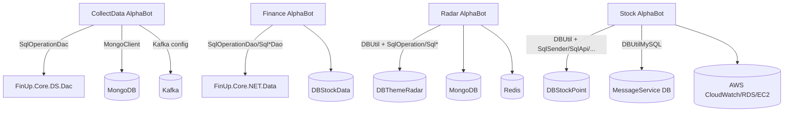

# 03. DB 접근 및 Stored Procedure 호출 맵

> 값/접속 문자열은 기록하지 않고 키/호출 위치만 기록한다. 실제 DB 접속은 수행하지 않았다.

## DB 접근 구조 요약

## 설정 기반 DB/캐시 연결 키

| 프로젝트 | 연결 키/이름 | 접근 코드 | 비고 |
|---|---|---|---|
| CollectData | `DBThemeRadar`, `MongoConnection`, `ConnectionKafka` | `Config/AppSetting.cs:9-13`, `Biz/Config/AppSetting.cs:10-14` | connectionStrings 기반, 일부 `.DecAES()` 사용 |
| Finance | `DBStockData` | `App.config` connectionStrings, `SqlOperationDao.ListOperationTerm("Finance")` | DAO 계층이 SQL 생성/실행 담당 |
| Radar | `DBThemeRadar`, `DBThemeRadarReal`, `MongoConnection*`, `RedisConnection` | `Config/AppSetting.cs`, `MainWindow.xaml.cs:213-216` | appSettings 기반 DBUtil 생성 |
| Stock | `DBStockPoint`, `ApiDBStockPoint`, `DBMessageServiceLgu`, `DBMessageServiceDanal` | `MainWindow.xaml.cs:29`, `Operation/ProcessBase.cs:74-95`, `ProcessBase.cs:140-157` | SQL DB + MySQL 유틸 혼합 |

## 주요 DB 접근 코드 위치

| 프로젝트 | 위치 | 접근 방식 | 근거 |
|---|---|---|---|
| CollectData | `AlphaBotBiz.cs` | `SqlOperationDac.ListOperationTerm("Data")`, `ProcOperationUpdate`, `ProcOperationTermHistoryInsert` | `AlphaBotBiz.cs:50`, `146`, `286`, `487` |
| CollectData | `CrawlerInfoStock.cs`, `CrawlerIndex.cs`, `CrawlerNaverStockRank.cs` | ScheduleNews/MarketIndex/Naver rank insert 계열 SP 호출 | `CrawlerInfoStock.cs:115-134`, `CrawlerIndex.cs:163`, `CrawlerNaverStockRank.cs:65` |
| Finance | `AlphaBotBiz.cs` | `SqlOperationDao.ListOperationTerm("Finance")`, `ProcOperationUpdate`, history insert | `AlphaBotBiz.cs:36`, `127`, `267`, `467` |
| Finance | `Operation/Unit/*.cs` | Ranking/StockSchedule/FinanceUpNews insert | `Ranking.cs:19`, `StockSchedule.cs:19`, `InvestRss.cs:147` |
| Radar | `MainWindow.xaml.cs` | `DBUtil.GetDataTable`, `ExecQuery`, operation term/history update | `MainWindow.xaml.cs:213-232`, `449`, `965-991`, `1072` |
| Radar | `Operation/ProcessUnit/*` | 공시/푸시/뉴스/테마/결제/검색 SP 호출 | `Operation/Process.cs:51-286`, `Operation/ProcessUnit/*` |
| Stock | `MainWindow.xaml.cs` | `DBUtil.GetDataTable`, `ProcOperationUpdate`, `USPOperationTermHistoryInsert` | `MainWindow.xaml.cs:115-128`, `703`, `889` |
| Stock | `Operation/ProcessBase.cs`, `Operation/ProcessUnit.cs` | `SqlSender`, `SqlApi`, `SqlChat`, `SqlAWSMonitoring`, MySQL util | `ProcessBase.cs:50-69`, `131-157`, `ProcessUnit.cs` |

## Stored Procedure/SQL 생성 호출 샘플

| 프로젝트 | 대표 호출 | 첫 발견 위치 | 의미 |
|---|---|---|---|
| CollectData | `ProcOperationUpdate` | `ViewModel/MainViewModel.cs:168` | 실행 시각 업데이트 |
| CollectData | `ProcOperationTermHistoryInsert` | `AlphaBotBiz.cs:487` | 실행 이력 START/STOP/ERROR 기록 |
| CollectData | `ProcScheduleNewsInsert`, `ProcScheduleNewsDetailInsert`, `ProcScheduleNewsKeywordInsert` | `CrawlerInfoStock.cs:115-134` | 일정 뉴스 수집 저장 |
| CollectData | `USPMarketIndexDayInsert`, `USPMarketIndicatorInsert` | `CrawlerIndex.cs:163`, `403` | 시장 지표 저장 |
| Finance | `USPRankingInsert` | `Operation/Unit/Ranking.cs:19` | 금융 랭킹 저장 |
| Finance | `USPStockScheduleInsert` | `Operation/Unit/StockSchedule.cs:19` | 주식 일정 저장 |
| Finance | `USP_FinanceUpNews_Insert` | `Operation/Unit/InvestRss.cs:147` | 금융 뉴스 저장 |
| Radar | `ProcOperationUpdate`, `ProcOperationTermHistoryInsert` | `MainWindow.xaml.cs:449`, `1072` | 실행 시각/이력 |
| Radar | `ProcQueuePushList`, `USPPushFormatSend`, `USPPushNonUserLogInsert` | `Push.cs`, `AttentionNews.cs` | 푸시 대상/발송/로그 |
| Radar | `USPThemeLogPush*`, `USPUserAlarmSummaryInsert` | `ThemeLogAlarmUser.cs`, `UserAlarmSummary.cs` | 테마 로그/사용자 알림 |
| Stock | `USPOperationTermHistoryInsert` | `MainWindow.xaml.cs:889` | 실행 이력 |
| Stock | `ProcApiServiceQueueHistoryInsert`, `ProcApiServiceUpdate` | `Operation/ProcessUnit.cs:1048`, `1135` | API 큐 처리 이력/상태 |
| Stock | `USPMonitoringAWS*` | `Operation/ProcessUnit.cs:3861`, `4012`, `4067`, `4143` | AWS 모니터링 |
| Stock | `USPEmailQueue*`, `USPSignalQueue*`, `USPPushQueueList` | `Operation/ProcessUnit.cs:5006`, `3205`, `2992` | 이메일/채팅/푸시 큐 |

## DB 장애 영향 분석

| 등급 | 조건 | 영향 | 근거 |
|---:|---|---|---|
| Critical | 초기 `ListOperationTerm` 실패 후 목록이 비거나 null | 스케줄 대상 자체가 로드되지 않거나 UI 초기화가 침묵 실패할 수 있음 | CollectData `AlphaBotBiz.cs:111-116`, Finance `AlphaBotBiz.cs:92-98`, Radar `MainWindow.xaml.cs:221-294`, Stock `MainWindow.xaml.cs:123-190` |
| Critical | 실행 이력 START 기록 후 작업 중 예외 발생 | CollectData/Finance/Radar는 `RunTask` catch에서 STOP/ERROR 이력 누락 가능. Stock은 finally로 END 기록 | CollectData `AlphaBotBiz.cs:348-373`, Finance `AlphaBotBiz.cs:329-353`, Radar `MainWindow.xaml.cs:1001-1036`, Stock `MainWindow.xaml.cs:691-730` |
| High | 설정 파일 내 DB/API/토큰 값 집중 | 운영 비밀값이 config에 위치. 값은 보고서에 기록하지 않음 | 각 `App.config`/`App.*.config` 키 목록 |
| High | SQL 생성 문자열이 다수 프로젝트/외부 참조에 분산 | SP 변경 영향 추적이 어려움 | `Sql*` 클래스 및 참조 프로젝트 사용 |

