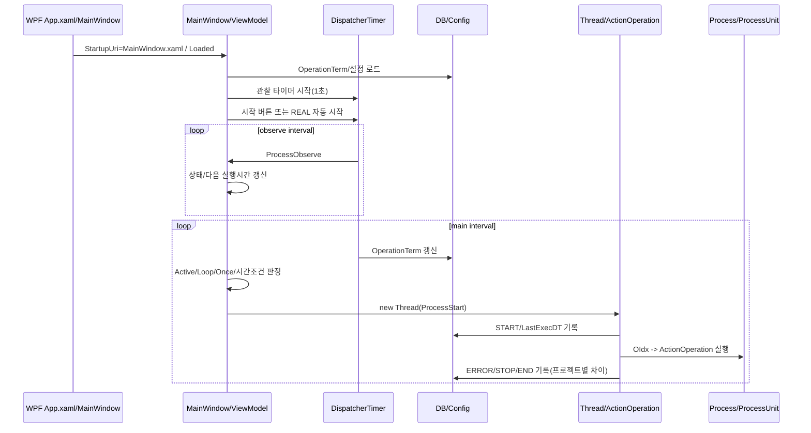
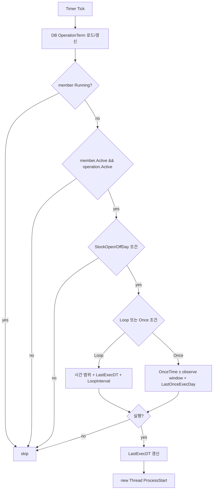

# 04. 런타임 흐름, 타이머, 루프, 스레드 분석

## 공통 실행 흐름

## 프로젝트별 진입점과 시작 조건

| 프로젝트 | 진입점 | 자동 시작 | 주요 초기화 | 근거 |
|---|---|---|---|---|
| CollectData | `App.xaml` `StartupUri="MainWindow.xaml"` → `MainWindow` → `MainViewModel` | 수동 시작 버튼 기반 | `AlphaBotBiz`, `tObserveTimer` 1초, `tMainTimer` `SettingAlphaBot.Config.ALPHABOT_OBSERVETIME` | `App.xaml:5`, `MainViewModel.cs:27-62`, `135-149` |
| Finance | `App.xaml` → `MainWindow` → `MainViewModel` | 수동 시작 버튼 기반 | `AlphaBotBiz`, `tObserveTimer` 1초, `tMainTimer` 5초 | `App.xaml:5`, `MainViewModel.cs:35-62`, `134-148` |
| Radar | `App.xaml` → `MainWindow.Loaded` | `ConfigServerType == "REAL"`이면 시작 버튼 호출 | `Operation.Process`, `tMainTimer` 5초, `tObserveTimer` 1초, `tAlive` 1분 | `MainWindow.xaml.cs:86-107`, `123-145`, `95-98` |
| Stock | `App.xaml` → `MainWindow.Loaded` | 명시 자동 시작 조건은 없음(시작 버튼) | `Operation.Process`, `tMainTimer` 5초, `tObserveTimer` 1초, `tAlphaBotTimer` 1분 | `MainWindow.xaml.cs:60-107`, `80-91`, `912-918` |

## 타이머/반복 작업 위치

| 프로젝트 | 타이머/루프 | 주기 | 역할 | 근거 |
|---|---|---:|---|---|
| CollectData | `tObserveTimer` | 1초 | UI 상태/현재시간/프로세스 관찰 | `MainViewModel.cs:43-44`, `76-88` |
| CollectData | `tMainTimer` | 설정값(`AlphaBot.ObServeTime`) | DB 스케줄 판정 후 작업 실행 | `MainViewModel.cs:43`, `96-98`, `AlphaBotBiz.cs:219-290` |
| Finance | `tObserveTimer` | 1초 | UI 상태/프로세스 관찰 | `MainViewModel.cs:42-43`, `75-87` |
| Finance | `tMainTimer` | 5초 | DB 스케줄 판정 후 작업 실행 | `MainViewModel.cs:42`, `95-97`, `AlphaBotBiz.cs:200-271` |
| Radar | `tObserveTimer` | 1초 | UI 표시/다음 실행시간 계산 | `MainWindow.xaml.cs:127-130`, `305-371` |
| Radar | `tMainTimer` | 5초 | OperationTerm 업데이트/작업 실행 | `MainWindow.xaml.cs:123-126`, `377-454` |
| Radar | `tAlive` | 1분 | ALIVE 이력 기록 | `MainWindow.xaml.cs:135-159` |
| Stock | `tObserveTimer` | 1초 | UI 표시/다음 실행시간 계산 | `MainWindow.xaml.cs:84-90`, `200-266` |
| Stock | `tMainTimer` | 5초 | OperationTerm 업데이트/작업 실행 | `MainWindow.xaml.cs:80-82`, `293-335` |
| Stock | `tAlphaBotTimer` | 1분 | AlphaBot alive/상태성 작업 | `MainWindow.xaml.cs:88-90`, `914-918` |

## Thread/Task 사용 위치

| 프로젝트 | Thread/Task 패턴 | 근거 | 관찰 |
|---|---|---|---|
| CollectData | `new Thread(new ParameterizedThreadStart(ProcessStart)).Start(...)` 후 내부에서 다시 Thread 생성 | `AlphaBotBiz.cs:148`, `290`, `325-331` | 이중 Thread 구조. `actionState`를 UI/스케줄러가 공유하지만 lock 없음 |
| Finance | CollectData와 동일 패턴 | `AlphaBotBiz.cs:129`, `271`, `306-312` | 이중 Thread 구조 및 침묵 catch 동일 |
| Radar | 스케줄 판정 후 `ProcessStart` Thread, 내부에서 `RunTask` Thread | `MainWindow.xaml.cs:454`, `699-718`, `969-994` | `Trace` 중심 예외 처리, state reset은 inner thread 정상 종료 후 수행 |
| Stock | 스케줄 판정 후 `ProcessStart` Thread, `try/catch/finally` 안에서 직접 실행 | `MainWindow.xaml.cs:335`, `678-730` | 네 프로젝트 중 실행 이력/상태 reset 구조가 가장 명확함 |
| Stock | 다수 `async`/외부 업로드/HTTP | `Operation/Process.cs:233-260`, `Operation/ProcessUnit.cs` | async void/외부 API 혼합 가능성 확인 필요 |

## BackgroundWorker 검색 결과

| 항목 | 결과 | 근거 |
|---|---|---|
| `BackgroundWorker` | 대상 4개 루트에서 정적 검색 결과 직접 사용 위치 없음 | `rg BackgroundWorker` 결과 없음 |
| `Task`/`async` | Finance RSS, Stock HTTP/API, 일부 CollectData/Radar 유틸에서 사용 | 예: Finance `InvestRss.cs`, Stock `Operation/Process.cs:233-260`, `Operation/ProcessUnit.cs` |

## 스케줄 판정 로직

## 예외 발생 시 턴 종료/이력 기록 차이

| 프로젝트 | 시작 이력 | 예외 이력 | 종료 이력 | Critical 판정 |
|---|---|---|---|---|
| CollectData | `SetOprationTermHistoryInsert(... START ...)` | `result.mTypeLog == Error`일 때만 ERROR, `RunTask` catch는 NLog/Console | 정상 흐름에서만 STOP | **Critical**: `RunTask` catch 경로에서 STOP/ERROR 이력 누락 가능 (`AlphaBotBiz.cs:348-373`) |
| Finance | START 기록 | `result.mTypeLog == Error`일 때만 ERROR, catch는 Console | 정상 흐름에서만 STOP | **Critical**: 예외 catch 경로에서 실행 턴 이력 불완전 (`AlphaBotBiz.cs:329-353`) |
| Radar | START 기록 | `result.mTypeLog == Error`일 때만 ERROR, catch는 Trace | 정상 흐름에서만 STOP | **Critical**: catch 경로에서 DB 이력 누락 가능 (`MainWindow.xaml.cs:1001-1036`) |
| Stock | START 기록 | catch에서 ERROR 이력 | finally에서 END 이력 및 `actionState=Stop` | 낮음: 구조상 턴 종료 이력 보장 (`MainWindow.xaml.cs:691-730`) |

