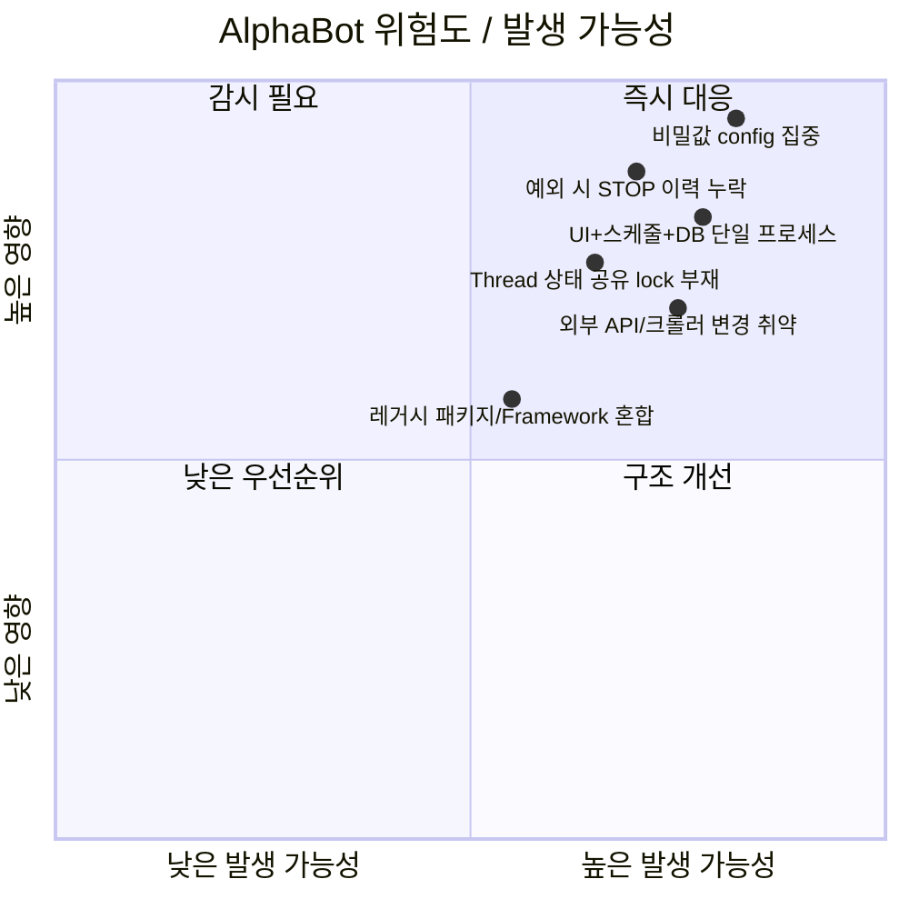

# 05. 위험 요소 보고서

## 요약 위험 매트릭스

## Critical 위험

| ID | 위험 | 영향 | 대상 | 근거 | 권고 |
|---|---|---|---|---|---|
| CR-01 | 예외 발생 시 실행 턴 이력 불완전 | START 후 STOP/ERROR 누락 시 운영자가 실행 중/실패 상태를 오판할 수 있음 | CollectData, Finance, Radar | CollectData `AlphaBotBiz.cs:348-373`, Finance `AlphaBotBiz.cs:329-353`, Radar `MainWindow.xaml.cs:1001-1036` | `try/catch/finally` 표준화, catch에서 ERROR 기록, finally에서 STOP/END 기록 |
| CR-02 | 운영 비밀값/접속정보가 config에 집중 | 유출 시 DB/API/텔레그램/AWS/Naver/Bitly/YouTube 등 접근 위험 | 전 프로젝트, 특히 Stock | `App.config`/`App.*.config` 키: `DB*`, `*Token`, `*Key`, `*Pwd`, `AWS*`, `Naver*` | Secret vault/환경변수/권한분리. 기존 값은 보고서에 기록하지 않음 |
| CR-03 | Stock AlphaBot 생성자에서 외부 SDK 초기화와 DB 접근이 즉시 수행 | 앱 시작 실패가 전체 운영 배치 중단으로 이어질 수 있음 | Stock | `Process.cs:78-89`, `Process.cs:94-115`, `ProcessBase.cs:129-133` | 지연 초기화, 실패 격리, 기능별 circuit breaker |

## High 위험

| ID | 위험 | 영향 | 대상 | 근거 | 권고 |
|---|---|---|---|---|---|
| H-01 | 빈 catch/침묵 실패 다수 | 장애 원인 추적 불가, 재시도/알림 누락 | 전체 | CollectData 빈 catch 16, Finance 11, Radar 23, Stock 15개 정적 집계 | 최소 로그+컨텍스트+재throw/상태반영 기준 수립 |
| H-02 | Thread 직접 생성 및 상태 공유 | 중복 실행, race condition, UI thread와 worker 상태 불일치 가능 | 전체 | `new Thread(...ProcessStart...)`, `member.actionState` 공유 | `Task`/scheduler abstraction, lock/Interlocked, cancellation token |
| H-03 | WPF UI가 스케줄러/운영 배치 호스트 역할 | UI 종료/Dispatcher 장애가 배치 중단으로 직결 | 전체 | `App.xaml StartupUri`, `DispatcherTimer`, `MainWindow` 중심 실행 | Worker Service/Windows Service 분리 검토 |
| H-04 | 외부 HTTP/API/크롤러 의존성 집중 | 외부 HTML/API 변경, 차단, timeout에 취약 | CollectData, Radar, Stock, Finance | `HttpClient`, `WebRequest`, `WebClient`, `CefSharp`, `WebDriverManager`, Naver/Telegram/AWS | timeout/retry/backoff/contract test/비동기 제어 표준화 |
| H-05 | SQL/SP 호출이 문자열 생성 계층에 분산 | SP 변경 영향 분석 어려움, SQL injection/escaping 책임 산재 | 전체 | 다수 `Sql*` 클래스, `ExecQuery`, `GetDataTable`, `Proc*/USP*` 호출 | SP catalog, typed repository, parameterized execution 점검 |

## 프로젝트별 위험 상세

| 프로젝트 | 핵심 위험 | 근거 |
|---|---|---|
| CollectData | 크롤러/텔레그램/Kafka/DB가 Biz에 집중, `throw new Exception(ex.Message)`로 stack 손실 | `CrawlerSite.cs:69`, `829-966`, `BaseCrawler.cs:34/54/68` |
| Finance | 파일 다운로드/impersonation 계정/DBStockData 의존, 예외 침묵 | `InvestRss.cs:165-174`, `App.config` 키, `AlphaBotBiz.cs:92-98` |
| Radar | REAL이면 자동 시작, DB/Redis/Mongo/Telegram/결제/API 혼합, Trace 로그 위주 | `MainWindow.xaml.cs:95-98`, `102-106`, `Operation/ProcessUnit/*` |
| Stock | 가장 큰 단일 프로세스: AWS/Firebase/YouTube/결제/푸시/이메일/API 큐/외부 업로드 | `ProcessBase.cs:72-95`, `ProcessUnit.cs`, `.csproj` 외부 references |

## 로그 처리 위험

| 프로젝트 | 로그 방식 | 위험 |
|---|---|---|
| CollectData | NLog + UI observable log + Console/Debug 일부 | NLog 설정 로드 실패 catch가 비어 있음 (`AlphaBotBiz.cs:32-39`) |
| Finance | UI observable log + Console | 중앙 로그 부족, `Console.WriteLine`은 WPF 운영에서 누락 가능 |
| Radar | `Trace` `Logs.txt` + UI log + TelegramSender 일부 | 로그 파일 고정명/경로와 Trace 중심 처리, 예외 컨텍스트 부족 |
| Stock | `LogWriter`, UI, Telegram alert, App global exception handler | Telegram 채널/토큰 설정 의존, `SetLog` catch 비어 있음 (`MainWindow.xaml.cs:840-872`) |

## 비밀값 노출 주의

본 보고서는 값 자체를 저장하지 않았다. 다만 다음 종류의 키가 소스 설정 파일에 존재한다.

- DB/connection: `DBThemeRadar`, `DBStockData`, `DBStockPoint`, `MongoConnection*`, `RedisConnection`, `ConnectionKafka`
- token/key: `HtsTelegramBotToken`, `TelegramBotKey`, `ChatApiKey`, `AWSAccessKey`, `AWSSecretKey`, `NaverApiClientSecretId`, `bitlyToken`, `YoutubeDataAPIKey`
- credential: `InfoStockID`, `InfoStockPassword`, `FileUserID`, `FileUserPwd`, `ServerID`, `ServerPWD`, `NaverLoginId`, `NaverLoginPw`

