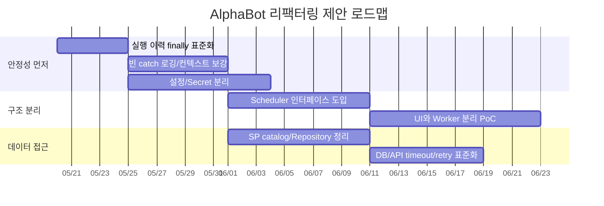

# 06. 리팩터링 우선순위 계획

> 전제: 현재 요청은 분석/문서화이며 소스 수정 금지. 아래는 향후 안전한 리팩터링 계획이다.

## 우선순위 로드맵

## 1단계: 운영 안정성 잠금

| 우선순위 | 작업 | 적용 대상 | 성공 기준 | 근거 |
|---:|---|---|---|---|
| P0 | 실행 턴 이력 `START -> ERROR? -> END/STOP` 보장 | CollectData, Finance, Radar | 예외 발생해도 이력 종료와 `actionState=Stop`이 보장됨 | `RunTask` catch 경로 이력 누락 가능 |
| P0 | 빈 catch 제거 또는 최소 로깅 추가 | 전체 | catch마다 OIdx/OTIdx/작업명/예외 타입/메시지 기록 | 빈 catch 다수 정적 집계 |
| P0 | 설정 비밀값 외부화 계획 수립 | 전체, 특히 Stock | 값은 vault/환경변수로 이전, config에는 키 참조만 남김 | config 민감 키 다수 |
| P1 | 외부 API/HTTP timeout/retry/backoff 표준화 | CollectData, Radar, Stock, Finance | 모든 HTTP 호출에 timeout과 실패 분류 존재 | WebRequest/HttpClient/WebClient 혼재 |

## 2단계: 스케줄러/스레드 구조 정리

| 작업 | 현재 | 제안 | 기대 효과 |
|---|---|---|---|
| Thread 직접 생성 제거 | `new Thread(new ParameterizedThreadStart(...))` 반복 | `Task.Run`, `CancellationToken`, 중앙 `IAlphaBotScheduler` | 취소/중복방지/예외전파 개선 |
| 상태 공유 보호 | `member.actionState` 직접 읽기/쓰기 | 상태 전환 메서드 + lock/Interlocked | 중복 실행/race 감소 |
| 타이머 표준화 | `DispatcherTimer`가 UI와 스케줄 모두 담당 | Worker timer/hosted service 분리 | UI hang과 배치 실패 분리 |
| 스케줄 판정 함수 추출 | 프로젝트별 중복 `GetLoopTimeToRun`, `GetOnceTimeToRun` | 공통 scheduler policy | 테스트 가능성 증가 |

## 3단계: DB 접근 정리

| 작업 | 대상 | 설명 |
|---|---|---|
| SP catalog 생성 | 전체 | `Proc*`, `USP*` 호출을 OIdx/기능/프로젝트/입출력으로 표준 문서화 |
| 파라미터화 점검 | Radar/Stock/Finance/CollectData | 문자열 SQL 생성/escaping 지점을 점검하고 파라미터 방식으로 통일 |
| DB access boundary | Core/SQL 계층 | UI/ProcessUnit이 직접 `GetDBUtil().ExecQuery`를 호출하지 않도록 repository/service 경계 도입 |
| 실행 이력 공통화 | 전체 | `OperationTermHistoryWriter` 같은 단일 컴포넌트로 START/ERROR/END 중복 제거 |

## 4단계: 프로젝트별 권고

| 프로젝트 | 단기 | 중기 | 장기 |
|---|---|---|---|
| CollectData | `CrawlerSite` Telegram/Kafka 오류 격리, `throw new Exception(ex.Message)` 제거 | 크롤러별 timeout/retry/circuit breaker | 크롤러 worker 서비스 분리 |
| Finance | `Sql*Dao`와 파일/RSS 처리 로깅 보강 | RSS 파서/파일 저장 유닛 테스트 | Finance batch service화 |
| Radar | `Trace`/UI/Telegram 로그 표준화, REAL 자동 시작 보호 | ProcessUnit별 DB/API 경계 분리 | Radar AlphaBot headless worker 전환 |
| Stock | Secret 외부화, AWS/Firebase 초기화 지연/격리 | `ProcessUnit.cs` 대형 파일 기능별 분리 | Stock API queue worker, monitor worker 등 서비스 분할 |

## 회귀 테스트/검증 권고

| 영역 | 테스트 | 성공 기준 |
|---|---|---|
| 스케줄 판정 | Loop/Once/OffDay/StockOpen 조합 단위 테스트 | 기존 실행 시간 조건 보존 |
| 이력 기록 | action 성공/실패/예외 케이스 | START/ERROR/END 순서 보장 |
| 설정 로딩 | 필수 키 누락/복호화 실패 | 앱 전체 중단 대신 명확한 진단 로그 |
| 외부 API | timeout/429/5xx/파싱 실패 | 재시도/스킵/알림 정책 일관 |
| DB | SP 호출 mock/fake | SQL 문자열 생성과 파라미터 escape 회귀 방지 |

## 변경 순서 원칙

1. 먼저 테스트/로깅으로 현재 동작을 관찰 가능하게 만든다.
2. 실행 이력/상태 reset처럼 운영 안정성에 직접 연결된 부분부터 작게 수정한다.
3. Secret 외부화는 배포 절차와 함께 진행한다.
4. UI와 worker 분리는 프로젝트별 PoC 후 점진 적용한다.
5. 대형 파일 분리는 기능 동작 테스트가 생긴 뒤 수행한다.

