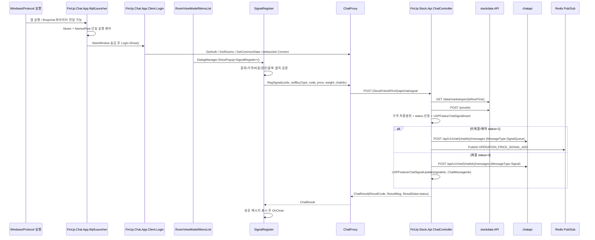

# FinUp Chat 매매신호 등록 실행 플로우 리포트

- 작성일: 2026-05-14
- 분석 대상 클라이언트: `FinUp.Chat.App.WpfLauncher`, `FinUp.Chat.App.Client`
- 분석 대상 버튼: `FinUp.Chat.App.Client.Dialog.SignalRegister.BtnSignalSave_Click`
- 서버 종착 후보/확인 endpoint: `FinUp.Stock.Api.Controllers.ChatController.PostSignalAsync`
- 산출물: `/mnt/c/reports/chat/signal-flow.md`, `/mnt/c/reports/chat/signal-flow.html`
- 분석 방식: 로컬 소스 정적 분석. 실행/네트워크 호출은 수행하지 않았다.

## 1. 결론 요약

`BtnSignalSave_Click`의 정상 등록 경로는 사용자가 매매신호 등록 모달에서 입력값을 통과한 뒤 `Session.Proxy.RegSignal(...)`을 호출하고, `ChatProxy.RegSignal`이 `StockPointAPIUrl + /api/chat/signal`로 `POST` 요청을 보내는 흐름이다. 운영 기본 config 기준 최종 URL은 다음과 같이 해석된다.

```text
POST https://apistock.finup.co.kr/api/chat/signal
  -> FinUp.Stock.Api/Controllers/ChatController.cs
  -> [HttpPost] [Route("api/chat/signal")] PostSignalAsync(ChatRequest rq)
```

서버 `PostSignalAsync`는 JWT 인증 후 현재가/장개장 여부를 stockdata API로 조회하고, 가격 허용범위를 검증한 뒤 DB 저장 프로시저를 호출한다. 저장 성공 후에는 신호 상태에 따라 채팅 메시지를 생성하고 chatapi로 메시지를 전송한다. 미체결 신호(`status == "1"`)이면 Redis 채널에 실시간 가격신호를 publish하고, 체결 신호(`status == "2"`)이면 채팅 메시지 번호를 다시 DB에 업데이트한다. 클라이언트는 `ResultCode == "1000"`이면 결과 메시지를 보여주고 모달을 닫는다.

## 2. 한 장 요약 플로우



## 3. 채팅앱 실행 플로우

### 3.1 WpfLauncher 시작

| 단계 | 동작 | 근거 |
|---:|---|---|
| 1 | WPF application entry는 `StartupUri="MainWindow.xaml"`이다. | `FinUp.Chat.App.WpfLauncher/App.xaml:1-5` |
| 2 | `App()` 생성자에서 문화권을 `ko-KR`로 설정하고 UI/background/task 예외 핸들러를 등록한다. | `FinUp.Chat.App.WpfLauncher/App.xaml.cs:53-59`, `60-70` |
| 3 | `OnStartup`은 브라우저/프로토콜 실행 인자를 URL decode하고 IoC를 구성한다. | `App.xaml.cs:89-98`, `71-88` |
| 4 | `UseMutex`가 켜져 있으면 `AppType` 기반 mutex 이름 `__FINUP_CHAT_{AppType}_MUTEX__`를 만들고 NamedPipe listener를 연다. 이미 실행 중이면 기존 프로세스에 wakeup 메시지를 보내고 현재 프로세스는 종료한다. | `App.xaml.cs:99-115` |
| 5 | 새 실행이면 theme/icon을 초기화하고 base startup으로 넘어간다. | `App.xaml.cs:137-144` |
| 6 | `MainWindow`는 화면 밖에 배치되고 `Loaded`에서 자신을 숨긴 뒤 `Login` 창을 생성해 보여준다. | `MainWindow.xaml.cs:11-28` |

NamedPipe 재진입 처리:

| 상황 | 처리 | 근거 |
|---|---|---|
| 이미 실행 중인 앱으로 wakeup 메시지 전달 | `Pipe_PipeMessage`가 Login 창을 활성화한다. | `App.xaml.cs:147-164` |
| `Action=RegLastSignal` query | `WindowEventType.RegLastSignal` 이벤트를 발행한다. | `App.xaml.cs:168-183` |
| 그 외 query | `RoomRefreshOpen` 이벤트를 발행해 `ChatIdx` 방을 연다. | `App.xaml.cs:184-188` |
| pipe server/client 구현 | `NamedPipe.Listen`, `WaitForConnectionCallBack`, `Send`가 비동기 pipe를 사용한다. | `NamedPipe.cs:47-59`, `71-99`, `107-126` |

### 3.2 Client 로그인/세션 초기화

| 단계 | 동작 | 근거 |
|---:|---|---|
| 1 | `Login` 생성자는 설정 파일/로컬 설정을 읽고 `Session.InitSession()`, `Session.StartLogDispacther()`를 호출한다. | `Login.xaml.cs:82-104` |
| 2 | `Session` static 생성자는 `Proxy = new ChatProxy()`를 만들고 공통 전역 데이터를 초기화한다. | `Session.cs:20-31`, `50-56` |
| 3 | `Session.InitSession`은 외부 IP/device ID/session ID/log session ID를 만든다. | `Session.cs:78-127` |
| 4 | 로그인 버튼은 네트워크 체크 후 email/password를 검증하고 `Session.Proxy.GetAuth`로 인증한다. | `Login.xaml.cs:568-621` |
| 5 | 인증 성공 후 `LoginSuccessAfter`에서 소켓 이벤트를 연결하고 방 목록, 사용자 프로필, 공통 데이터를 조회한다. | `Login.xaml.cs:701-765` |
| 6 | 채팅 channel routing 서버를 조회해 websocket `Connect`/`ConnectFree`를 수행한다. | `Login.xaml.cs:779-793` |

### 3.3 API base URL 설정

| 설정 | 기본 운영 값 | 용도 | 근거 |
|---|---|---|---|
| `StockPointAPIUrl` | `https://apistock.finup.co.kr` | 매매신호 등록 endpoint base. `RegSignal`이 `/api/chat/signal`을 붙인다. | `FinUp.Chat.App.WpfLauncher/App.config:14`, `ChatProxy.cs:73`, `528` |
| `StockDataAPIUrl` | `https://stockdata.finup.co.kr/api` | 클라이언트의 가격/체결감시 보조 조회 base. | `App.config:12`, `ChatProxy.cs:74`, `ChatProxy.StockData.cs:43` |
| `ChatAPIRootUrl` | `https://chatapi.finup.co.kr` | 채팅방/메시지/공지 등 chatapi 호출 base. | `App.config:7`, `ChatProxy.cs:66`, `114` |
| `AuthWebAPIAddress` | `https://apiauth.finup.co.kr/api/auth/app` | 로그인/JWT 인증 endpoint base. | `App.config:10`, `ChatProxy.cs:62-64` |

`App.Debug.config`, `App.Dev.config`, `App.Staging.config`, `App.Release.config`는 환경별로 같은 key를 pre/dev/prd host로 바꾼다. 예: Debug/Staging은 `https://pre-apistock.finup.co.kr`, Dev는 `https://dev-apistock.finup.co.kr`, Release/App.config는 `https://apistock.finup.co.kr`를 사용한다.

## 4. 매매신호 등록 모달 진입 플로우

매매신호 등록 모달은 여러 UI 경로에서 열린다.

| 진입 경로 | 동작 | 근거 |
|---|---|---|
| 채팅방 단축키 `Ctrl+1` | 멘토/관리자 + SignalList 노출 + Trade 타입이면 `DialogManager.ShowPopup<SignalRegister>(..., isBuySet:true)` 호출 | `RoomViewModel.cs:1228-1244` |
| 채팅방 단축키 `Ctrl+2` | 같은 조건이면 매도 세팅으로 `ShowPopup<SignalRegister>(..., "000000", isSellSet:true)` 호출 | `RoomViewModel.cs:1246-1261` |
| 일반 등록 action | `RegisterSignal()`이 `IsSignalRegisterOpened=true` 후 `ShowPopup<SignalRegister>(Dialog, ChatRoom, "")` 호출 | `RoomViewModel.cs:1321-1331` |
| 메뉴 리스트 버튼 | `btnSignalRegister_Click`가 `DialogManager.ShowPopup<SignalRegister>(RoomDialog, _chatRoom, "")` 호출 | `UserControls/MenuList.xaml.cs:267-273` |
| 다른 창 이벤트 | `SignalRegisterSellOpen` 이벤트가 오면 `args.StockCode`로 SignalRegister를 연다. | `RoomViewModel.cs:1748-1764` |

모달 표시 권한은 채팅방 초기화 시 멘토 또는 관리자에게만 `IsSignalRegisterShown`을 켜는 구조다.

- `RoomViewModel.cs:2132-2143` — `ChatUserType.Mentor` 또는 `Admin`이면 service visibility에 따라 신호 등록 버튼을 표시하고, 아니면 숨긴다.

## 5. SignalRegister 로딩/입력 준비 흐름

| 단계 | 동작 | 근거 |
|---:|---|---|
| 1 | 생성자에서 XAML을 초기화하고 가격/비중 textbox의 한글 IME를 비활성화한다. | `SignalRegister.xaml.cs:51-58` |
| 2 | `Ctrl+S` preview key를 등록 버튼 click event로 변환한다. | `SignalRegister.xaml.cs:61-74` |
| 3 | `SetMessage`가 부모가 전달한 `ChatRoom`, `StockCode`, `IsBuySet`, `IsSellSet`를 저장한다. | `SignalRegister.xaml.cs:77-83` |
| 4 | `Window_Loaded`에서 `Session.Proxy.GetSignalCode(..., 1)`로 종목 리스트를 로드하고, `Binding_SellStock()`으로 보유종목을 바인딩한다. | `SignalRegister.xaml.cs:85-94`, `195-223` |
| 5 | 매수/매도 기본 세팅을 적용하고, 종목명 대문자 보정 후 `SignalRegisterOpen` window event를 발행한다. | `SignalRegister.xaml.cs:95-117` |
| 6 | 매수 종목 선택/매도 종목 선택 시 `ChangedDefaultPrice(code)`가 현재가를 조회해 기본 추천가를 채운다. | `SignalRegister.xaml.cs:295-325`, `489-501` |
| 7 | XAML 등록 버튼은 `Click="BtnSignalSave_Click"`에 연결된다. | `SignalRegister.xaml:222-227` |

## 6. 등록 버튼 클릭 상세 플로우

### 6.1 클라이언트 검증과 요청 생성

`BtnSignalSave_Click`는 UI 입력값을 모두 통과해야만 서버로 간다.

| 순서 | 검증/처리 | 실패 시 | 근거 |
|---:|---|---|---|
| 1 | 클릭 로그 `SignalSaveClick` 기록 | 없음 | `SignalRegister.xaml.cs:329-333` |
| 2 | 매수/매도 중 하나가 체크되어야 함 | “신호를 선택해 주세요” | `SignalRegister.xaml.cs:336-397` |
| 3 | 종목명 필수 | “종목명을 입력해 주세요.” | `SignalRegister.xaml.cs:338-339` |
| 4 | 매수는 자동완성 종목을 선택해야 함 | “자동 생성되는 문구를 클릭해 주세요.” | `SignalRegister.xaml.cs:340-341` |
| 5 | 매도는 보유 종목이 있어야 함 | “매도는 보유종목 내에서만 가능합니다.” | `SignalRegister.xaml.cs:342-343` |
| 6 | 추천가격/비중 필수 및 숫자 변환 | 각 입력 오류 메시지 | `SignalRegister.xaml.cs:344-351` |
| 7 | 비중은 0보다 커야 함 | “비중은 0보다 커야 합니다.” | `SignalRegister.xaml.cs:352-353` |
| 8 | 채팅방 권한이 일반 User면 중단 | “권한이 없습니다.” | `SignalRegister.xaml.cs:356-360` |
| 9 | 선택 index가 종목 목록 범위를 벗어나면 중단 | “선택된 종목이 올바르지 않습니다.” | `SignalRegister.xaml.cs:362-366` |
| 10 | `_isRegisterEnabled`로 중복 클릭 방지 | 이미 처리 중이면 return | `SignalRegister.xaml.cs:368-372` |
| 11 | 가격 콤마 제거, 매수/매도 타입·종목코드·종목명·가격·비중 산출 | 정상 요청 준비 | `SignalRegister.xaml.cs:373-380` |
| 12 | `Session.Proxy.RegSignal(...)` 호출 | 서버 결과 대기 | `SignalRegister.xaml.cs:381` |

요청 모델 변환:

| 필드 | 값의 출처 | 근거 |
|---|---|---|
| `CUIdx` | `_chatRoom.ChatUserIdx` | `SignalRegister.xaml.cs:381`, `ChatProxy.cs:517-532` |
| `SellBuyType` | `cbBuy`이면 `Buy`, 아니면 `Sell` | `SignalRegister.xaml.cs:375`, `ChatProxy.cs:520-532` |
| `Type` | SignalRegister는 문자열 `"1"` 고정 전달 | `SignalRegister.xaml.cs:381`, `ChatProxy.cs:521-533` |
| `Code`, `Name` | 매수 자동완성 선택 또는 매도 보유종목 선택 | `SignalRegister.xaml.cs:376-377` |
| `Price`, `Weight` | textbox 문자열을 int 변환 | `SignalRegister.xaml.cs:378-381`, `ChatProxy.cs:536-537` |
| `Score` | `0` 고정 | `ChatProxy.cs:538` |
| `ChatIdx` | `_chatRoom.ChatIdx` | `SignalRegister.xaml.cs:381`, `ChatProxy.cs:539` |

`ChatSignalRequest` 모델은 `CUIdx`, `SellBuyType`, `Type`, `Code`, `Name`, `Price`, `Weight`, `Score`, `ChatIdx`를 가진다. `SellBuyType`은 `Buy=1`, `Sell=2`다. 근거: `FinUp.Chat.NET.Model/Contracts/ChatSignalRequest.cs:5-16`, `FinUp.Chat.NET.Model/Enums/SellBuyType.cs:23-33`.

### 6.2 ChatProxy HTTP 전송

| 단계 | 동작 | 근거 |
|---:|---|---|
| 1 | `ChatProxy` 생성자는 config에서 `_stockPointAPIUrl = StockPointAPIUrl`을 읽는다. | `ChatProxy.cs:57-75` |
| 2 | `RegSignal`은 `url = $"{_stockPointAPIUrl}/api/chat/signal"`을 만든다. | `ChatProxy.cs:517-528` |
| 3 | `ChatSignalRequest`를 만들고 `RequestAsync<ChatResult>("POST", url, param)`를 호출한다. | `ChatProxy.cs:529-542` |
| 4 | 응답에 메시지가 있으면 `AfterRequestActionIfHasMessage`로 사용자 메시지를 처리하고 `ChatResult`를 반환한다. | `ChatProxy.cs:542-545` |
| 5 | `RequestAsync<TResult>`는 `ChatWebAPIRequestAsync`로 위임한다. | `ChatProxy.API.cs:117-120` |
| 6 | 요청 전 `EnsureAuthTokenFreshAsync()`로 JWT 만료를 점검/갱신한다. | `ChatProxy.API.cs:192-200`, `ChatProxy.Auth.cs:75-109` |
| 7 | `CreateTraceHeader`는 JWT header에 `SessionID`, `RequestID`, `AccessType=5`를 추가한다. | `ChatProxy.API.cs:20-39` |
| 8 | param을 JSON serialize한 뒤 `Util.WebRequestJsonAsync`로 실제 HTTP 요청을 보낸다. | `ChatProxy.API.cs:212-228` |
| 9 | 401이면 refresh 후 재귀 재시도, 403이면 device 정책 상태 전환, 네트워크 장애는 `TaskCanceledException`으로 변환한다. | `ChatProxy.API.cs:263-310` |

운영 기본 config 기준 URL:

```text
StockPointAPIUrl = https://apistock.finup.co.kr
RegSignal URL   = https://apistock.finup.co.kr/api/chat/signal
HTTP method     = POST
Request body    = ChatSignalRequest JSON
Auth/trace      = JWT + SessionID + RequestID + AccessType=5
```

## 7. 서버 `PostSignalAsync` 상세 플로우

### 7.1 Endpoint 매핑

| 항목 | 값 | 근거 |
|---|---|---|
| Controller | `FinUp.Stock.Api.Controllers.ChatController` | `FinUp.Stock.Api/Controllers/ChatController.cs:29-33` |
| Method | `PostSignalAsync(ChatRequest rq)` | `ChatController.cs:840-843` |
| HTTP/Route | `[HttpPost]`, `[Route("api/chat/signal")]` | `ChatController.cs:840-842` |
| 인증 | `[JwtAuthentication]` | `ChatController.cs:842` |
| 외부 base | `ApiStockDataAddress`, `ChatApiUrl` 등 appSettings | `BaseController.cs:33-34`, `ChatController.cs:34-47`, `Web.config:89`, `98` |

### 7.2 서버 처리 순서

| 순서 | 처리 | 실패/분기 | 근거 |
|---:|---|---|---|
| 1 | JWT claim, request fields(`CUIdx`, `SellBuyType`, `Type`, `Code`, `Name`, `Price`, `Weight`, `Score`, `ChatIdx`)를 지역변수로 꺼낸다. | 예외 시 catch | `ChatController.cs:848-860` |
| 2 | `GetMatketOpenAsync()`로 장 개장 여부를 조회한다. 내부 URL은 `{ApiStockDataAddress}/data/marketopen/{isRealTime}`. | stockdata 호출 실패 시 catch 경로 | `ChatController.cs:862-864`, `2815-2818` |
| 3 | `GetStockPriceAsync(code)`로 현재가를 조회한다. 내부 URL은 `{ApiStockDataAddress}/pricelist` POST. | 현재가가 없거나 숫자 변환 실패하면 `ErrorApiStockPrice` 반환 | `ChatController.cs:865-874`, `2821-2841` |
| 4 | `SignalTolerancePercentMax` 기본 10%로 입력가가 현재가 대비 허용 범위인지 검증한다. | 초과하면 `BadRequest` 반환 | `ChatController.cs:876-883`, `Web.config:95-97` |
| 5 | 장중이면 매수는 1.5%, 매도는 0.5% 이내일 때 즉시 체결(`status="2"`), 아니면 미체결(`status="1"`). 장전/장후는 미체결. | status 분기 | `ChatController.cs:885-916` |
| 6 | `SqlChat.USPFeaturChatSignalInsert`로 신호를 DB 저장한다. | DB result code가 1000이 아니면 해당 code/msg 반환 | `ChatController.cs:918-951` |
| 7 | `PortfolioSignalIdx`를 읽고 `ChatSignalHistoryResult`를 구성한다. | idx 읽기 실패는 trace만 남김 | `ChatController.cs:953-973` |
| 8A | `status == "1"`: 예약/미체결 메시지를 만들고 `MessageType.SignalQueue`로 chatapi에 POST한다. | chatapi 실패는 상위 catch 가능 | `ChatController.cs:976-1012` |
| 9A | `status == "1"`: Redis `REDIS_CHANNEL_PRICE_SIGNAL`에 `OPERATION_PRICE_SIGNAL_ADD`를 publish한다. publish 실패는 trace만 남긴다. | publish 실패를 등록 실패로 되돌리지는 않음 | `ChatController.cs:1013-1030`, `2714-2745` |
| 8B | `status != "1"`: 즉시 등록 메시지를 만들고 `MessageType.Signal`로 chatapi에 POST한다. | chatapi 실패는 상위 catch 가능 | `ChatController.cs:1032-1068` |
| 9B | `status != "1"`: `USPFeatureChatSignalUpdate(signalIdx, chatMsgResult.ChatMessageIdx)`로 메시지 번호를 DB에 연결한다. | 실패 시 catch 가능 | `ChatController.cs:1068-1071` |
| 10 | `ChatResult`에 `ResultCode`, `ResultMsg`, `ResultData=status`를 넣고 반환한다. | 정상 종료 | `ChatController.cs:1074-1080` |
| 11 | 예외는 `ErrorUnknown` + exception message/string으로 반환한다. | 오류 종료 | `ChatController.cs:1082-1086` |

### 7.3 서버 내부 외부 호출

| 호출 | URL 패턴 | 목적 | 근거 |
|---|---|---|---|
| stockdata market open | `{ApiStockDataAddress}/data/marketopen/{isRealTime}` | 장중/장전/장후 판단 | `ChatController.cs:2815-2818` |
| stockdata price list | `{ApiStockDataAddress}/pricelist` | 현재가 조회 | `ChatController.cs:2821-2841` |
| chatapi message post | `{ChatApiUrl}/api/v1/chat/{chatIdx}/messages` | 신호 메시지/예약신호 메시지 생성 | `ChatController.cs:42-47`, `1012`, `1068` |
| Redis publish | `REDIS_CHANNEL_PRICE_SIGNAL` | 미체결 신호 실시간 감시 등록 알림 | `ChatController.cs:1017-1023`, `2714-2745` |

## 8. 클라이언트 반환 처리와 종료

| 상황 | 클라이언트 처리 | 근거 |
|---|---|---|
| `RegSignal` 반환 직후 | `_isRegisterEnabled = true`로 중복 클릭 방지를 해제한다. | `SignalRegister.xaml.cs:381-383` |
| `ResultCode == "1000"` | 서버 `ResultMsg`를 보여주고 `SignalRegisterSuccessClose` 로그를 남긴다. | `SignalRegister.xaml.cs:385-389` |
| 성공 | `DialogResult = true`, `OnClose?.Invoke(this, e)`로 모달을 닫는다. | `SignalRegister.xaml.cs:391-392` |
| 모달 unload | `SignalRegisterDialogClosed` window event를 발행한다. | `SignalRegister.xaml.cs:552-555` |
| 서버/요청 결과 오류 | `ChatProxy.RegSignal` 내부 `AfterRequestActionIfHasMessage`가 메시지를 처리하고, `BtnSignalSave_Click`는 성공 code가 아니면 닫지 않는다. | `ChatProxy.cs:542-545`, `SignalRegister.xaml.cs:385-393` |

## 9. 전체 상세 플로우 번호도

1. 사용자가 WpfLauncher를 실행한다.
2. `App.OnStartup`이 인자 decode, IoC 구성, mutex/pipe 단일 실행 제어를 수행한다.
3. `MainWindow`가 숨겨지고 `Login` 창이 표시된다.
4. `Login` 생성자가 설정/로컬 설정을 읽고 `Session.InitSession`으로 session/device/log context를 초기화한다.
5. 로그인 버튼 클릭 시 네트워크 확인 후 `Session.Proxy.GetAuth`로 인증한다.
6. 인증 성공 후 방 목록/사용자/공통 데이터를 조회하고 websocket channel/free channel을 연결한다.
7. 채팅방 UI에서 멘토/관리자이고 signal service가 보이면 매매신호 등록 버튼/단축키가 활성화된다.
8. 등록 버튼, 단축키, 메뉴, 외부 window event 중 하나가 `DialogManager.ShowPopup<SignalRegister>`를 호출한다.
9. `SignalRegister`는 종목 리스트와 보유 종목을 로딩하고 매수/매도 기본 상태를 설정한다.
10. 사용자가 등록 버튼 또는 `Ctrl+S`를 누른다.
11. `BtnSignalSave_Click`가 입력값, 권한, 종목 선택, 비중, 중복 클릭 상태를 검증한다.
12. 매수/매도 타입, 종목코드, 종목명, 가격, 비중을 만들고 `Session.Proxy.RegSignal`을 호출한다.
13. `ChatProxy.RegSignal`이 `ChatSignalRequest` JSON을 만들어 `POST {StockPointAPIUrl}/api/chat/signal`로 보낸다.
14. `ChatProxy.API` 레이어가 JWT/trace header를 추가하고, 필요하면 token refresh 후 재시도한다.
15. `FinUp.Stock.Api`의 `ChatController.PostSignalAsync`가 JWT 인증 아래 request를 수신한다.
16. 서버가 stockdata로 장 개장 여부와 현재가를 조회한다.
17. 서버가 가격 허용범위와 체결/미체결 status를 결정한다.
18. 서버가 `USPFeaturChatSignalInsert`로 신호를 DB에 저장한다.
19. 저장 실패면 DB result code/message를 즉시 반환한다.
20. 저장 성공 + 미체결이면 `SignalQueue` 메시지를 chatapi에 쓰고 Redis에 실시간 가격신호 add를 publish한다.
21. 저장 성공 + 체결이면 `Signal` 메시지를 chatapi에 쓰고 `USPFeatureChatSignalUpdate`로 signal과 message id를 연결한다.
22. 서버가 `ChatResult(ResultCode=1000, ResultMsg, ResultData=status)`를 반환한다.
23. 클라이언트가 성공 메시지를 띄우고 모달을 닫는다.

## 10. 확인된 불확실성 / 런타임 확인 필요 지점

| 항목 | 정적 분석 결론 | 추가 확인 필요 |
|---|---|---|
| 실제 배포 host | source `App.config`/Release 기준은 `https://apistock.finup.co.kr`; Debug/Staging/Dev는 pre/dev host를 사용한다. | 실제 배포 파일 transform 결과 또는 운영 exe.config 확인 |
| `PostSignalAsync` request type | client는 `ChatSignalRequest`, server method signature는 `ChatRequest rq`다. property 이름이 맞아 model binding 가능하다는 구조로 보인다. | 서버 `ChatRequest` 정의/배포 assembly 확인 |
| chatapi 전송 후 websocket 반영 | 서버는 chatapi에 메시지를 POST한다. client는 로그인 시 websocket channel에 연결되어 있으므로 chatapi/channel 경로로 메시지가 전파되는 구조로 추정된다. | channel 서버 구현/운영 websocket 로그 확인 |
| DB stored procedure 내부 | `USPFeaturChatSignalInsert`, `USPFeatureChatSignalUpdate` 내부 SQL은 이 분석 범위에서 열람하지 않았다. | DB procedure 정의 확인 |

## 11. 근거 파일 목록

| 파일 | 확인 내용 |
|---|---|
| `FinUp.Chat.App.WpfLauncher/App.xaml` | WPF startup uri |
| `FinUp.Chat.App.WpfLauncher/App.xaml.cs` | startup, mutex, named pipe, wakeup action 처리 |
| `FinUp.Chat.App.WpfLauncher/MainWindow.xaml.cs` | Login 창 표시 |
| `FinUp.Chat.App.WpfLauncher/NamedPipe.cs` | 단일 실행 재진입 message transport |
| `FinUp.Chat.App.WpfLauncher/App.config` | 운영 기본 API URL 설정 |
| `FinUp.Chat.App.Client/Login.xaml.cs` | session init, auth, rooms/common data, websocket connect |
| `FinUp.Chat.App.Client/Session.cs` | `ChatProxy` singleton 및 session context |
| `FinUp.Chat.App.Client/ViewModel/RoomViewModel.cs` | SignalRegister 진입 조건/단축키/window event |
| `FinUp.Chat.App.Client/UserControls/MenuList.xaml.cs` | 메뉴 버튼을 통한 SignalRegister open |
| `FinUp.Chat.App.Client/Dialog/SignalRegister.xaml` | 등록 버튼 Click handler 연결 |
| `FinUp.Chat.App.Client/Dialog/SignalRegister.xaml.cs` | 입력 로딩/검증/RegSignal 호출/성공 close |
| `FinUp.Chat.App.Client/Proxy/ChatProxy.cs` | URL 조립, `RegSignal`, request model 생성 |
| `FinUp.Chat.App.Client/Proxy/ChatProxy.API.cs` | HTTP JSON request, JWT/trace header, retry/error 처리 |
| `FinUp.Chat.NET.Model/Contracts/ChatSignalRequest.cs` | client request DTO |
| `FinUp.Chat.NET.Model/Enums/SellBuyType.cs` | 매수/매도 enum |
| `FinUp.Stock.Api/Controllers/ChatController.cs` | final endpoint 및 서버 후속 처리 |
| `FinUp.Stock.Api/Controllers/BaseController.cs` | stockdata base config 읽기 |
| `FinUp.Stock.Api/Web.config` | tolerance, ChatApiUrl, ApiStockDataAddress 설정 |

## 12. 완료 감사 체크리스트

| 요구사항 | 증거 |
|---|---|
| `/mnt/c/reports/chat` 위치에 작성 | 본 파일 및 HTML 파일이 해당 디렉터리에 생성됨 |
| 파일명 `signal-flow` | `signal-flow.md`, `signal-flow.html` |
| MD/HTML 각각 생성 | 두 파일 모두 생성 및 검증 |
| `FinUp.Chat.App.WpfLauncher` 실행 플로우 분석 | 3장에 startup/mutex/pipe/login handoff 정리 |
| `FinUp.Chat.App.Client` 실행 플로우 분석 | 3.2장에 login/session/auth/websocket 정리 |
| 매매신호 등록 모달 등록 버튼 플로우 분석 | 4~8장에 모달 진입, 입력 검증, proxy request, 반환 처리 정리 |
| `BtnSignalSave_Click` 확인 | `SignalRegister.xaml.cs:329-381` 근거로 분석 |
| 최종 endpoint `PostSignalAsync` 확인 | `ChatController.cs:840-843`에서 `POST api/chat/signal` 확인 |
| 최종 실행 종료까지 요약본/상세본 | 1~2장 요약, 3~9장 상세 흐름 포함 |
